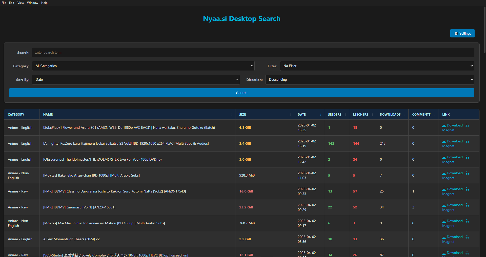

# nyaa-desktop-app

A basic desktop application related to nyaa.

## Features

*   Search for torrents on Nyaa.si directly from your desktop.
*   Filter results by category (Anime, Audio, Literature, etc.).
*   Sort results by various criteria like date, size, seeders, leechers, and downloads.
*   View detailed information about a torrent, including its description, file list, hash, and peer counts.
*   Download the `.torrent` file or copy the magnet link with a single click.

## How to Run

1.  **Prerequisites:** Ensure you have [Node.js](https://nodejs.org/) installed.
2.  **Clone the repository (if you haven't already):**
    ```bash
    git clone https://github.com/flotnsq/nyaa-desktop-app.git
    cd nyaa-desktop-app
    ```
3.  **Install dependencies:**
    ```bash
    npm install
    ```
4.  **Run the app:**
    ```bash
    npm start
    ```
    *(If `npm start` doesn't work, try `electron .`)*

## Screenshots

**Main Search Interface:**


**Torrent Details View:**
 